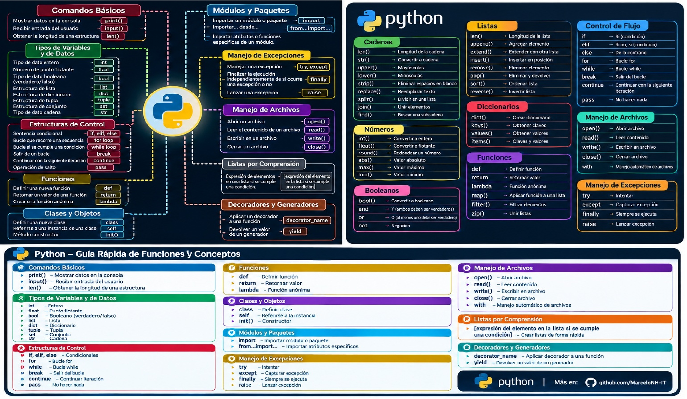
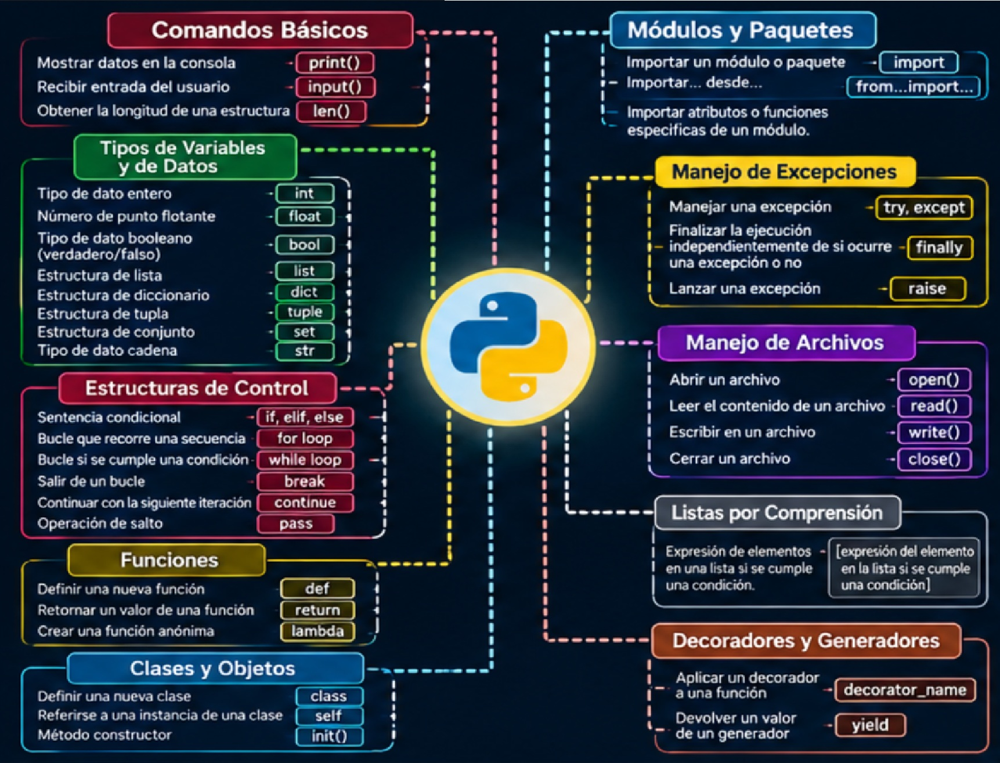
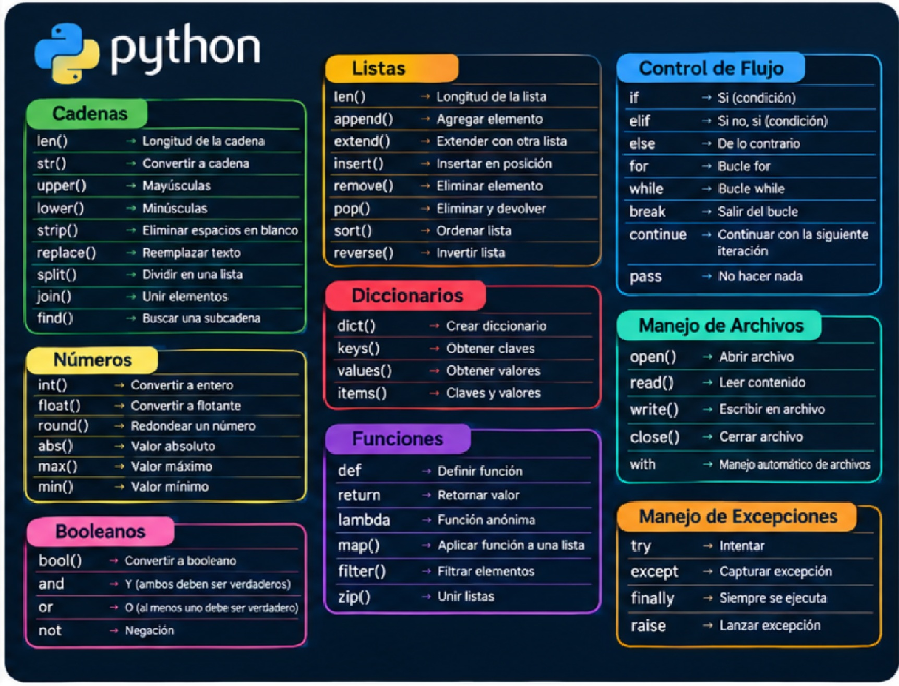
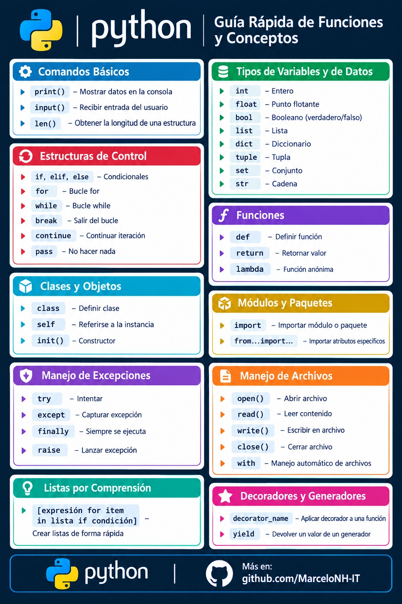

# python-guia-estudio
guia practica conceptos de python 

# 1. Estructura de Directorios


```
python-fundamentos-guia/
│
├── 01_condicionales/
│   ├── 01_if_else.py
│   └── 02_match_case.py
│
├── 02_strings/
│   └── 01_manipulacion_texto.py
│
├── 03_bucles/
│   ├── 01_while_y_contadores.py
│   └── 02_break_continue.py
│
├── 04_estructuras_datos/
│   ├── 01_listas_y_tuplas.py
│   └── 02_diccionarios.py
│
├── .gitignore
├── LICENSE
└── README.md
```
# 2. El archivo .gitignore


Crea un archivo llamado exactamente .gitignore en la raíz y agrega esto:

# Entornos virtuales
venv/
env/
.env

# Archivos de caché de Python
__pycache__/
*.py[cod]
*$py.class

# Configuraciones del editor (ej. VS Code)
.vscode/

# 3. El archivo README.md (El documento de presentación)


# 🐍 Fundamentos de Python: Guía Práctica y Código


Este repositorio contiene una colección estructurada de scripts orientados a dominar los fundamentos lógicos y estructurales de Python. Está diseñado como material de referencia rápida y demuestra buenas prácticas de escritura de código.

## 📖 Glosario de Sintaxis y Comandos Básicos

Para facilitar la lectura de los scripts incluidos en este repositorio, aquí tienes una guía rápida de las palabras clave y funciones que encontrarás en el código:

*   `print("texto")`: Imprime un mensaje o el valor de una variable en la consola.
*   `#`: Indica el inicio de un comentario. El programa ignora todo lo que esté a la derecha del numeral; sirve para dejar notas al lector.
*   `def nombre_funcion():`: Define (crea) una nueva función o bloque de código reutilizable.
*   `if` / `elif` / `else`: Estructuras de decisión. Evalúan si una condición es verdadera (`if`), si hay condiciones alternativas (`elif`), o qué hacer si ninguna se cumple (`else`).
*   `while`: Crea un bucle que repite el código que tiene dentro *mientras* una condición siga siendo verdadera.
*   `break`: Interrumpe y finaliza un bucle de manera inmediata.
*   `continue`: Salta el resto del código de la iteración actual del bucle y pasa a la siguiente.
*   `len(variable)`: Devuelve la longitud de un elemento (por ejemplo, cuántas letras tiene un texto o cuántos elementos tiene una lista).
*   `type(variable)`: Te muestra qué tipo de dato contiene una variable (ej. texto, número entero, lista).

---

## 🏗️ Estructura del Repositorio

El proyecto está dividido en módulos prácticos:

### 1. Condicionales y Toma de Decisiones (`/01_condicionales`)
- Operadores relacionales (`==`, `!=`, `>=`, etc.).
- Estructuras clásicas `if`, `elif`, `else`.
- Implementación de `match-case` para evaluación de patrones.

### 2. Manipulación de Cadenas de Texto (`/02_strings`)
- Concatenación, índices y slices (`[inicio:fin]`).
- Métodos integrados: `.lower()`, `.upper()`, `.strip()`, `.replace()`.
- Formateo moderno utilizando **f-Strings**.

### 3. Control de Flujo con Bucles (`/03_bucles`)
- Estructura `while` para bucles basados en condiciones.
- Uso de contadores y acumuladores.
- Control de iteraciones usando `break` y `continue`.

### 4. Estructuras de Datos (`/04_estructuras_datos`)
- **Listas:** Mutables y dinámicas (`.append()`, `.remove()`, `.sort()`).
- **Tuplas:** Inmutables, ideales para proteger datos estáticos.
- **Diccionarios:** Estructuras clave-valor para acceso rápido (`.get()`, `.keys()`, `.values()`, `.items()`).

---

## 🚀 Cómo utilizar este repositorio

1. Clona el repositorio en tu máquina local:
   ```bash
   git clone [https://github.com/TU_USUARIO/python-guia-estudio.git](https://github.com/TU_USUARIO/python-guia-estudio.git)


# Navega al directorio del proyecto:
```
cd python-guia-estudio
```
# Ejecuta cualquier script utilizando tu entorno de desarrollo o la terminal:
```
python 01_condicionales/01_if_else.py
```
📝 Buenas Prácticas Aplicadas
Código formateado bajo el estándar PEP 8.

Uso de nombres de variables descriptivos (Clean Code).

Scripts autocontenidos y comentados adecuadamente.

📄 Licencia
Este proyecto está bajo la Licencia MIT. Siéntete libre de utilizar, modificar y distribuir este código.

*(Nota: Recuerda cambiar `TU_USUARIO` en el bloque de instalación por tu nombre de usuario real de GitHub).*

### 4. Ejemplos de Código (El contenido de los `.py`)
Para que los scripts sean profesionales, asegúrate de documentar qué hace el código e imprimir resultados claros. Por ejemplo, en tu archivo `01_if_else.py` podrías poner:

```python
"""
Demostración de condicionales básicos en Python.
"""

def verificar_acceso(edad, tiene_credencial):
    if edad >= 18 and tiene_credencial:
        print("Acceso concedido al sistema.")
    elif edad >= 18 and not tiene_credencial:
        print("Acceso denegado: Credencial faltante.")
    else:
        print("Acceso denegado: Usuario menor de edad.")

# Pruebas de ejecución
if __name__ == "__main__":
    verificar_acceso(25, True)
    verificar_acceso(20, False)
```

# Sintaxis Python







## 📖 Python - Guía Rápida de Funciones y Conceptos

A continuación, se detalla el glosario completo de sintaxis básica, métodos y estructuras, organizado por tipo de dato y funcionalidad para una lectura rápida.

### 🛠️ Comandos Básicos y Variables
| Comando | Descripción |
| :--- | :--- |
| `print()` | Mostrar datos en la consola |
| `input()` | Recibir entrada del usuario |
| `len()` | Obtener la longitud de una estructura |

### 📌 Tipos de Variables y de Datos
| Tipo | Descripción |
| :--- | :--- |
| `int()` | Entero (Convertir a entero) |
| `float()` | Punto flotante / Decimal (Convertir a flotante) |
| `bool()` | Booleano (Verdadero/Falso) |
| `str()` | Cadena de texto (Convertir a cadena) |
| `list` | Lista |
| `dict` | Diccionario |
| `tuple` | Tupla |
| `set` | Conjunto |

### 🔤 Métodos de Cadenas (Strings)
| Método | Descripción |
| :--- | :--- |
| `upper()` | Convertir a mayúsculas |
| `lower()` | Convertir a minúsculas |
| `strip()` | Eliminar espacios en blanco |
| `replace()` | Reemplazar texto |
| `split()` | Dividir en una lista |
| `join()` | Unir elementos |
| `find()` | Buscar una subcadena |

### 📋 Métodos de Listas y Diccionarios
| Método / Estructura | Descripción |
| :--- | :--- |
| **Listas** | |
| `append()` | Agregar elemento al final |
| `extend()` | Extender con otra lista |
| `insert()` | Insertar en posición específica |
| `remove()` | Eliminar elemento |
| `pop()` | Eliminar y devolver el elemento |
| `sort()` | Ordenar lista |
| `reverse()` | Invertir lista |
| **Diccionarios** | |
| `keys()` | Obtener claves |
| `values()` | Obtener valores |
| `items()` | Obtener claves y valores |

### ⚙️ Estructuras de Control de Flujo
| Sintaxis | Descripción |
| :--- | :--- |
| `if` / `elif` / `else` | Sentencias condicionales |
| `for` | Bucle que recorre una secuencia |
| `while` | Bucle que se ejecuta mientras se cumpla una condición |
| `break` | Salir del bucle |
| `continue` | Continuar con la siguiente iteración |
| `pass` | Operación de salto / No hacer nada |

### 📐 Funciones, Clases y Módulos
| Sintaxis | Descripción |
| :--- | :--- |
| `def` | Definir una nueva función |
| `return` | Retornar un valor de una función |
| `lambda` | Función anónima |
| `class` | Definir nueva clase |
| `self` | Referirse a una instancia de una clase |
| `init()` | Método constructor |
| `import` | Importar un módulo o paquete |
| `from...import...`| Importar atributos específicos |

### 📂 Manejo de Archivos y Excepciones
| Sintaxis | Descripción |
| :--- | :--- |
| **Archivos** | |
| `open()` | Abrir un archivo |
| `read()` | Leer el contenido de un archivo |
| `write()` | Escribir en un archivo |
| `close()` | Cerrar un archivo |
| `with` | Manejo automático de archivos |
| **Excepciones** | |
| `try` | Intentar ejecutar código |
| `except` | Capturar y manejar una excepción |
| `finally` | Siempre se ejecuta, ocurra o no un error |
| `raise` | Lanzar una excepción manualmente |

### ✨ Conceptos Avanzados
| Sintaxis | Descripción |
| :--- | :--- |
| `[expresion for item in list if condicion]` | **Listas por Comprensión:** Crear listas de forma rápida iterando y aplicando una condición |
| `@decorator_name` | **Decoradores:** Aplicar un decorador a una función |
| `yield` | **Generadores:** Devolver un valor de un generador |


(El script 05_glosario.py (Manejo de Archivos y Excepciones)

---

## 💻 Ejemplo de Implementación

En el archivo `05_glosario.py` de este repositorio se implementa un bloque de manejo de excepciones y archivos para interactuar con el sistema de forma segura:

```python
print("--- Sistema de Consulta de Dominios ---")

# 1. MANEJO DE EXCEPCIONES (try / except / finally)
try:
    # Intentamos abrir un archivo en modo lectura ("r") que quizás no exista todavía
    with open(nombre_archivo, "r") as archivo:
        contenido = archivo.read()
        print("\nDominios registrados actualmente:")
        print(contenido)
        
except FileNotFoundError:
    # Si ocurre el error "FileNotFoundError" (el archivo no existe), lo capturamos aquí
    print(f"\n[!] Error: El archivo '{nombre_archivo}' no existe en el sistema.")
    print("[*] Creando un nuevo archivo de registro...")
    
    # 2. MANEJO DE ARCHIVOS (Modo escritura "w")
    # El bloque 'with' se encarga de aplicar close() automáticamente al terminar
    with open(nombre_archivo, "w") as archivo:
        archivo.write("AB123CD\n")
        archivo.write("EF456GH\n")
        archivo.write("KSD845\n")
        
    print("[+] Archivo creado y dominios de prueba guardados con éxito.")
    
finally:
    # Esto se ejecuta SIEMPRE, haya ocurrido un error o no
    print("\n--- Operación de lectura/escritura finalizada ---")
```


# 💡 Nota: Te invito a explorar los archivos del repositorio para clonarlos y ejecutarlos en tu entorno local.


<p align="center">
  
</p>
🤝 Conclusión y Contacto 🤝


* **💼 LinkedIn**: [Horacio Marcelo Nuñez](https://linkedin.com) 
* **📬 Correo Electrónico**: [marcelonh86@gmail.com](marcelonh86@gmail.com)
* **🚀 GitHub**: [@MarceloNunez-NOC](https://github.com/MarceloNunez-NOC)

---

## 🎯 Conclusión y Proyección Profesional

Agradezco el tiempo de quienes visitan este repositorio. Este proyecto forma parte de mi camino de formación continua en **Python, redes y administración de sistemas**, diseñado para demostrar que puedo estructurar código limpio, documentar procesos y resolver problemas lógicos con un enfoque metódico.

Mi objetivo como profesional de IT es aportar valor mediante el diagnóstico preciso, la automatización de tareas y la documentación clara de incidentes. Los scripts que comparto reflejan mi capacidad de evolucionar desde la lógica básica hacia la resolución de escenarios complejos.

Invito a reclutadores, colegas y referentes del sector a explorar mis repositorios, donde continuo integrando herramientas de redes, infraestructura y programación. Estoy abierto a colaborar y aportar mi experiencia en entornos tecnológicos que valoren la constancia, el orden y la resolución analítica de problemas.

